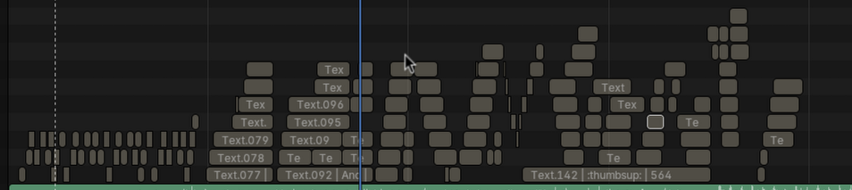
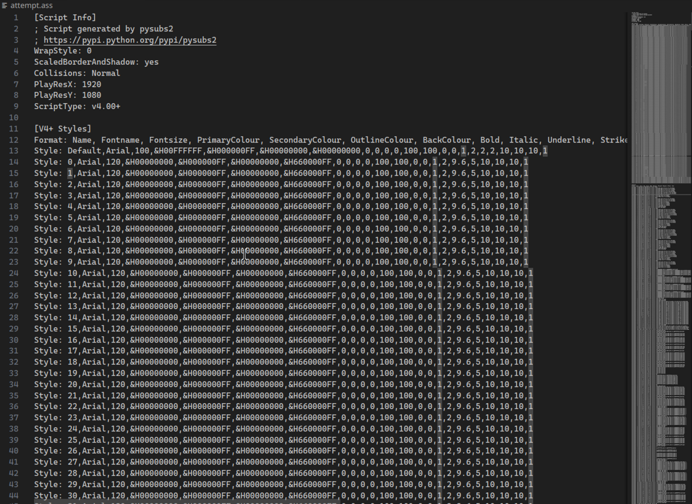
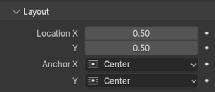

A script I made to convert TextSequences to .ass (SubStation Alpha) subtitle format.






Many features are missing at the time. For the best experience, try to install an "Arial"-esque font and refrain from updating fileds in the Layout dropdown menu.



### Installation:

To install the subs dependency, run 
```bash
/path/to/blender/4.3/python/python -m pip install pysubs2
```
The script will not work without this package.


Select the text sequences in your VSE and run the 
script in a window.
To change the filename of the resulting .ass, edit the OUTPUT_PATH variable in the main.py variable.

I may turn this into an extension in the future, Idk